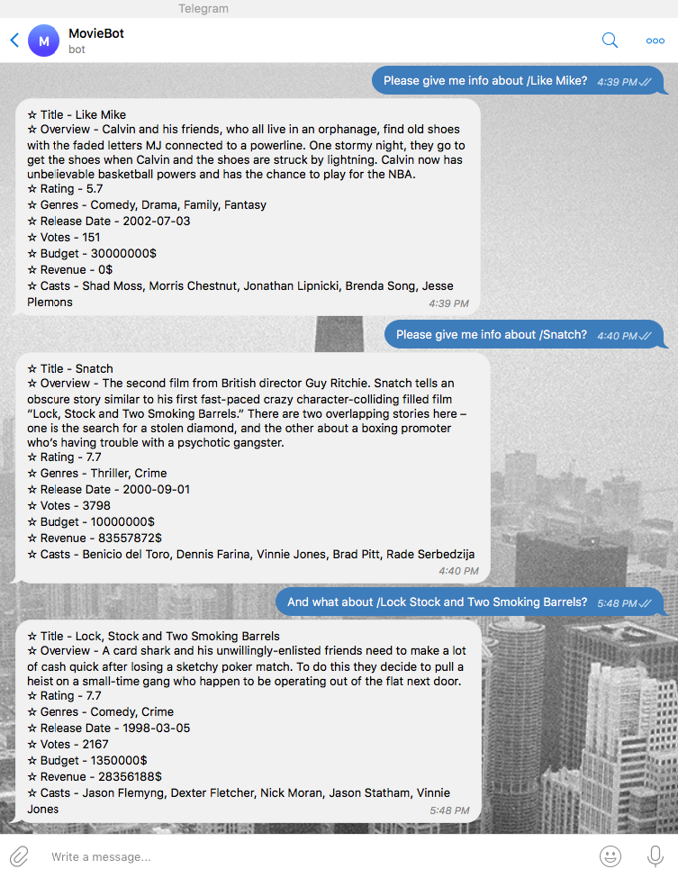

# Movie telegram bot
> Telegram bot powered by a webhook that helps you to get information about your favorite movie.
> 
> Bot is called `MovieBot` that is served by [pythonanywhere.com](https://pythonanywhere.com) hosting, search for it in the  telegram. Enjoy it!



## Tools:
- python 3.6+
- [flask](https://flask.palletsprojects.com)

## Usage
Run script from the root directory of the project:
```bash
~ python bot.py
```

## Contributing
- clone the repository
- configure Git for the first time after cloning with your name and email
  ```bash
  git config --local user.name "Volodymyr Yahello"
  git config --local user.email "vyahello@gmail.com"
  ```
- `python3.6` is required to run the code
- run `pip install -r requirements.txt` to install all required python packages
